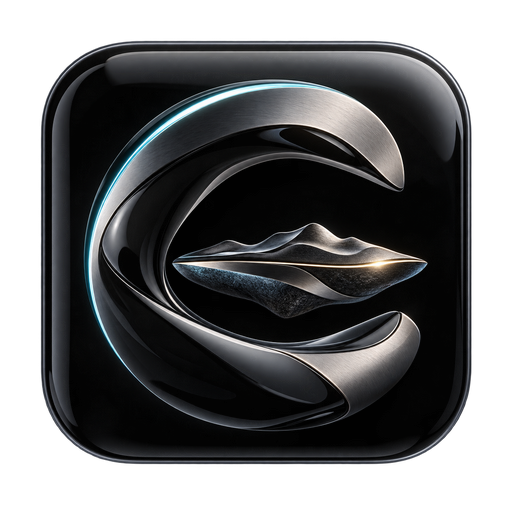
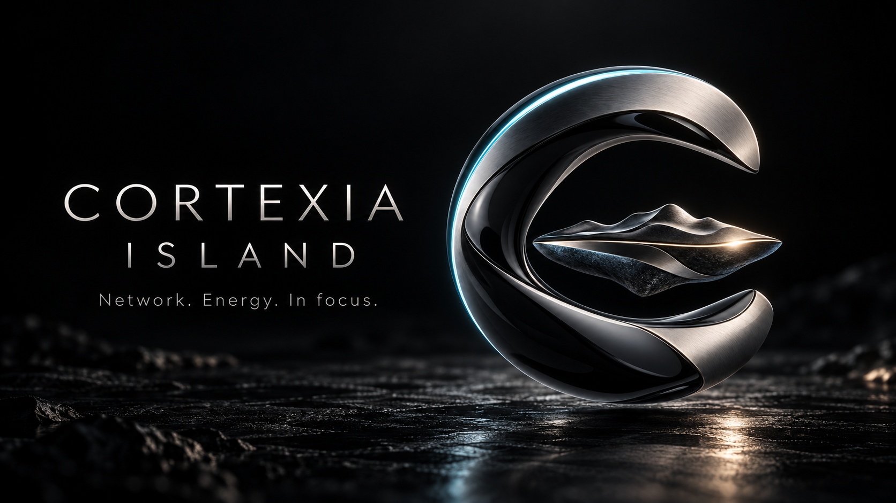
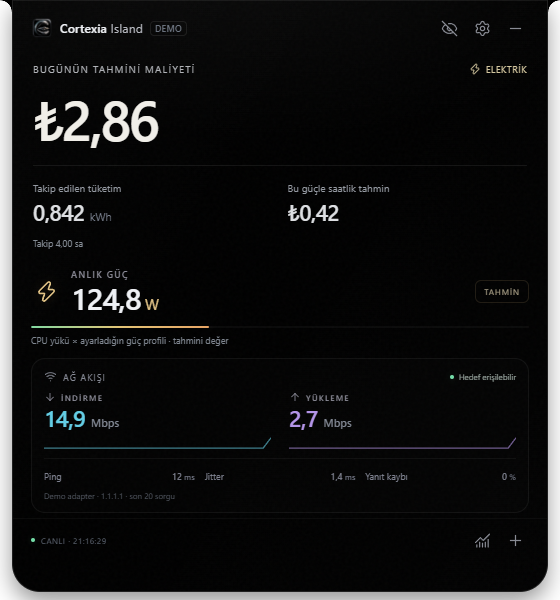
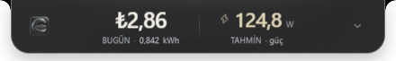

<p align="center"></p>
<h1 align="center">Cortexia Island</h1>
<p align="center"></p>
<p align="center">Power. Cost. Clarity.<br>A quiet OLED black island for PC electricity, estimated cost and live network health.</p>
<p align="center"><a href="https://github.com/GhostFelina/cortexia-island/actions/workflows/ci.yml"></a>  </p>
<p align="center"><a href="https://github.com/GhostFelina/cortexia-island/releases">Download</a> · <a href="docs/README.tr.md">Türkçe</a> · <a href="docs/ROADMAP.md">Roadmap</a> · <a href="CONTRIBUTING.md">Contribute</a></p>

<p align="center"></p>
<p align="center"><sub>Demo readings shown above. Your installation uses live local data.</sub></p>
<p align="center"></p>

Cortexia Island is a compact, frameless desktop overlay with subtle grain, restrained light reflections and true black surfaces. Collapse it to a pill, expand it for detail, or select and reorder widgets in Settings. It is an independent design; it is not affiliated with Apple.

<p align="center"> </p>

## What works today

- **Cost first:** today's estimated electricity cost leads both compact and expanded views, alongside tracked kWh, instantaneous watts and an hourly estimate at the current power. An explicit tariff setup action appears when no price is configured.
- **Online tariff setup:** first launch asks only for a Turkish city and district. The standard national residential lower-tier tariff are retrieved directly from EPDK, validated and applied with tax-inclusive price, effective date and check date. Location stays local. It is a standard-tariff estimate: location cannot establish special contracts, SKTT, commercial rates or the household tier. See [tariff sources and scope](docs/TARIFFS.md).
- **Network:** selected adapter throughput, ICMP target latency, jitter and lost replies over the last 20 probes. Readings every ~2 seconds, probes every ~6 seconds.
- **Energy:** configurable idle/full load profile; optional Shelly Gen2/Gen3 outlet power readings; daily measured/estimated kWh and costs based on your tariff.
- **Widgets:** network, power, energy, CPU/RAM, notebook battery, local clock, electrical health and energy insights. Select and reorder them from a list.
- **Desktop:** thin compact notch, concave shoulders, optional edge attachment on every display, free cross-monitor drag-to-move, four-corner resizing with saved sizes per view, taskbar/Dock and tray icons, show/hide shortcut, opacity, click-through recovery, always on top, display selection, reduced motion and optional login startup.
- **Taskbar indicator:** Windows has an independent live indicator in the lower-left taskbar area. Choose one or two metrics: cost, kWh, watts, download, upload or ping. Click it to open the island; disable it in Settings. It overlays this area, not the native weather widget. Auto-hiding or non-bottom taskbars are not supported.
- **Mac droplet:** compact mode defaults to a droplet on macOS. Click to open or pull down for a springy stretch and release to open. Drag the small grip to move it. Reduced motion is supported; real MacBook validation is pending.
- **Electrical health:** compatible meters can report voltage, current, frequency, temperature, power factor and protection alerts. Missing fields stay blank. These are meter reports, not a grid/PSU safety diagnosis.
- **Data:** local storage, atomic writes, 14 automatic backups, validated JSON restore, CSV export and recovery after a corrupt primary file.
- **Releases:** versioned Windows x64 `.exe` installer and macOS arm64/x64 `.dmg` + `.zip`, generated by GitHub Actions. Updates are checked on request, never installed silently.
- **Quality:** strict TypeScript, energy/restore/input tests, desktop smoke tests, dependency audits and cross-platform CI.

## Before interpreting the numbers

**Throughput is current traffic, not a speed test of your internet plan.** Adapter traffic can include LAN traffic. Ping checks one chosen target, not the whole internet; ICMP filtering can cause missed replies. Jitter is the mean absolute difference between consecutive successful probes. Virtual adapters are excluded from the selection list.

**CPU load cannot measure whole-PC wall power.** The default 65–350 W profile is an illustrative model to calibrate for your hardware, with no claim of measurement accuracy. GPU load, monitors, PSU losses and peripherals are not measured by this model. A dedicated outlet meter provides a meaningful wall reading when only the PC is connected.

**Daily energy covers tracked time only.** Time while the app is closed, sleeping, disconnected from a meter, or missing readings is excluded. Estimated and measured energy stay separate. A changed tariff applies to future samples; prior unpriced energy is not retroactively billed. Currency locks after priced energy has been recorded. This is an estimate of PC cost, not an electricity supplier invoice.

## Install

Download the package for your architecture from [Releases](https://github.com/GhostFelina/cortexia-island/releases). Windows installs per user and retains your data on uninstall. Use the tray icon or **Ctrl/⌘ + Shift + I** to show or hide the island; **Esc** collapses it. The first setup asks only for city/district; no electricity unit price is needed. The gear opens optional widget, power and appearance settings.

The first alpha packages are **unsigned**. macOS signing/notarization and Windows signing are planned before stable distribution. macOS in-app installation of updates requires signed releases; use the release packages while this is being established. macOS 13+ is required by [Electron 44](https://releases.electronjs.org/release/v44.0.0). Windows 11 x64 is the first locally exercised platform; macOS builds and smoke tests run on hosted macOS runners, with real MacBook validation still required.

### Shelly outlet meter

Choose **Shelly Gen2/Gen3** in Settings and enter a local IPv4 address. The app reads `http://<local-ip>/rpc/Switch.GetStatus?id=0` and expects a numeric `apower` field. The first alpha supports a single channel with no device authentication. It never switches the outlet. A failed reading pauses measurement rather than inventing a fallback value. Only use this with a device you own on your trusted local network.

## Develop

Node.js 24 and Git are sufficient; Electron bundles its runtime in the finished app.

```sh
npm ci
npm run dev
npm run check
npm run smoke
npm run dist:win  # Windows
npm run dist:mac  # macOS
```

Dependencies and lockfiles are project local. Recreate `node_modules` on each machine. UI development listens only on `127.0.0.1:5371`; a browser alone does not have system telemetry access.

See [architecture](docs/ARCHITECTURE.md), [widget development](docs/WIDGETS.md), [release procedure](docs/RELEASING.md) and [cross-device setup](docs/CROSS_DEVICE.md).

Read the [design audit](docs/DESIGN_AUDIT.md) for the electricity-first hierarchy and its validation scope.

## Privacy

No analytics, accounts or cloud telemetry. Data remains in Electron’s per-user application directory. The routine external connection is the configured ICMP ping target. Online tariff requests contact EPDK without transmitting city, district or personal identifiers. Update checks contact GitHub only when requested; a selected meter is contacted on your local network. Exported backups include settings, location preferences and energy history: review them before sharing.

## Help shape the island

Open a widget idea or reproducible bug report. Clear screenshots, reliable readings, small contributions and accessible interactions are especially welcome. Stars help people discover the project; the roadmap is driven by real use and feedback.
