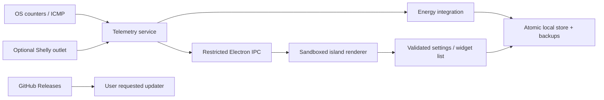

# Architecture

- `main/telemetry.ts`: OS-independent sampling loop. `systeminformation` supplies platform network/battery adapters; native Node CPU counters supply CPU load. Sampling is serialized. Network discovery and battery refresh every 30 seconds. Meter and ping calls have timeouts.
- `main/core.ts`: pure settings validation, private meter-host validation, model calculation, energy integration and versioned backup validation. Midnight uses the current local calendar. Gaps longer than 10 seconds are discarded; system suspend/resume resets integration.
- `main/store.ts`: schema v1, flushed temporary write then rename, bounded history (366 dates), rotating backups (14), CSV. Future schemas are rejected. Corrupt primary data is preserved if no valid backup exists. Before a supported schema migration, keep a backup and write migration tests.
- `main/main.ts`: native window, tray, display positioning, startup setting, file dialogs and updates. IPC accepts only the trusted main frame. No renderer navigation or new windows. Restore first validates the file, then asks before replacing data.
- `main/preload.ts`: small, explicitly defined bridge. No arbitrary filesystem, process, shell or network APIs reach the renderer.
- `src/app.ts`: small dependency-free view layer; updates numeric DOM nodes instead of replacing cards on each reading. All external names are escaped. Widgets are selected and ordered by the user.
- `src/style.css`: OLED black, procedural grain, subtle lens material, restrained reflected light, tabular numbers, keyboard focus and reduced motion.
- `shared/types.ts`: typed contracts between providers, store, IPC and renderer.

The load-based estimate intentionally does not claim to infer GPU utilization, temperature or wall power. Additional power providers must label their scope. Component sensors must never be presented as whole-PC measurements.

Versioned packets and local data backups are independent. Updating binaries preserves the per-user data directory. JSON export provides a portable backup; installations do not sync live data across machines.
