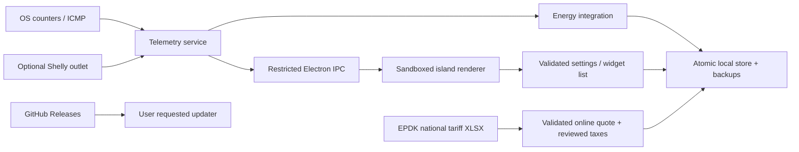

# Architecture

- `main/telemetry.ts`: OS-independent sampling loop. `systeminformation` supplies platform network/battery adapters; native Node CPU counters supply CPU load. Sampling is serialized. Network discovery and battery refresh every 30 seconds. Meter and ping calls have timeouts.
- `main/core.ts`: pure settings validation, private meter-host validation, model calculation, energy integration and versioned backup validation. Midnight uses the current local calendar. Gaps longer than 10 seconds are discarded; system suspend/resume resets integration.
- `main/store.ts`: schema v1, flushed temporary write then rename, bounded history (366 dates), rotating backups (14), CSV. Future schemas are rejected. Corrupt primary data is preserved if no valid backup exists. Before a supported schema migration, keep a backup and write migration tests.
- `main/main.ts`: native window, tray, display positioning, startup setting, file dialogs and updates. IPC accepts only the trusted main frame. No renderer navigation or new windows. Restore first validates the file, then asks before replacing data.
- `main/preload.ts`: small, explicitly defined bridge. No arbitrary filesystem, process, shell or network APIs reach the renderer.
- `main/tariff.ts`: fixed-origin bounded HTTPS retrieval, currently effective document selection, typed residential row/column/date validation and reviewed taxes. A failed quote never changes the saved price; location stays local. See TARIFFS.md.
- `src/app.ts`: small vanilla TypeScript view layer with bundled Lucide icons; updates numeric DOM nodes instead of replacing cards on each reading. All external names are escaped. Widgets are selected and ordered by the user.
- `src/style.css`: OLED black, procedural grain, subtle lens material, restrained reflected light, tabular numbers, keyboard focus and reduced motion.
- `shared/types.ts`: typed contracts between providers, store, IPC and renderer.

The load-based estimate intentionally does not claim to infer GPU utilization, temperature or wall power. Additional power providers must label their scope. Component sensors must never be presented as whole-PC measurements.

Versioned packets and local data backups are independent. Updating binaries preserves the per-user data directory. JSON export provides a portable backup; installations do not sync live data across machines.

## Alpha.6 platform surfaces and electrical metadata

A separate sandboxed Windows BrowserWindow renders the taskbar-area indicator with a restricted TaskbarAPI (state subscription and show-island only). Sender and main-frame identity are validated independently. It follows the primary display's bottom work-area gap, hides for auto-hidden/non-bottom taskbars and does not inject into Explorer or alter system weather. Preferences are additive schema-v1 fields; updates preserve history. Tray tooltip carries live energy/cost/watts; the macOS menu-bar title carries cost.

Compact mode defaults to metrics on Windows and a droplet on macOS; the explicit mode is portable. The droplet uses pointer capture, bounded stretch, spring return, pull-open, keyboard/click-open and reduced motion. A separate native grip preserves cross-monitor movement. Detail and metric views keep four-corner resizing.

Shelly GetStatus metadata is parsed as finite bounded nullable readings, with recognized protection flags. No estimate supplies electrical health. The UI explicitly separates meter reports from a safety diagnosis. Provider reference: [Shelly Switch](https://shelly-api-docs.shelly.cloud/gen2/ComponentsAndServices/Switch/). Windows native widget providers target the [Widgets host](https://learn.microsoft.com/en-us/windows/apps/develop/widgets/widget-providers); Cortexia's indicator is an independent overlay, not a registered weather-button replacement.

## Alpha.8 usage, session tracking and presentation

`main/usage.ts` runs the installed official Codex CLI app-server over stdio, initialize/initialized plus read-only account/rateLimits/read and rateLimits/updated. No thread/turn/model generation. Reads time out after 15 seconds, response buffer is bounded, polling is 60 seconds. Only documented 300/10080-minute windows are rendered; invalid/missing/expired fields remain missing. Failed/old reports become stale. Disabling the widgets/bar metrics stops the child.

The opt-in Claude bridge copies a bundled CJS helper to the app's per-user integrations folder and configures the documented user statusLine. It saves the previous line, backs up local settings, preserves unrelated fields and chains the previous command. Removal restores only if the configured command is still Cortexia's, avoiding overwrite of subsequent user changes. The helper stores only usage percentages, resets and receivedAt; no session content or authentication. refreshInterval re-runs the script and cannot prove independent backend freshness.

The additive schema-v1 boot record stores estimated/measured Wh, cost, priced Wh and tracked seconds. Kernel boot time and a hashed Windows logon ID identify continuation without keeping the raw ID. Application restart in the same session retains totals. Suspend and quit flush only a last valid interval of at most ten seconds; sleeping/closed/unavailable periods are excluded. Fast Startup/new login resets the session when the logon ID changes. macOS uses kernel uptime; real device tests remain pending.

Presentation is saved independently of view: island, bar only, native application or both. Switching into/out of native frame relaunches after saving. Only compatible bar modes show the Windows overlay/Mac menu title. Bar-only allows a temporary Settings window and hides it on return. Native main-window close hides into tray so session tracking continues; Exit stops. Native app mode uses normal frame/resize/minimize, opaque black and no always-on-top/click-through. Sandboxing and sender checks are unchanged. Packaged smoke starts both actual frame configurations before publication.

`shared/bar.ts` defines the ten-second electricity/Codex/Claude groups and fixed fallback. The Windows renderer maintains its own elapsed clock, pauses on hover and resumes on leave; a new data snapshot does not reset the cycle. Native smoke waits through actual intervals, then verifies pause/resume. Mac title uses the same groups at telemetry cadence. Backend refresh cadence remains independent.
